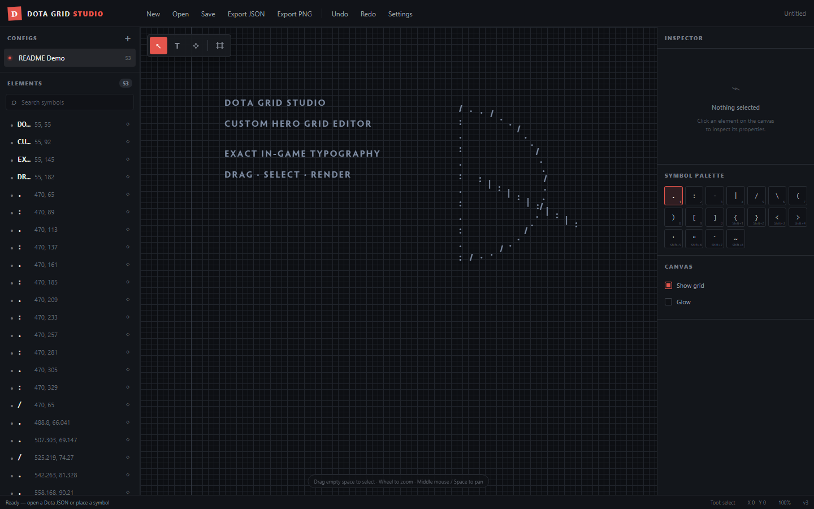
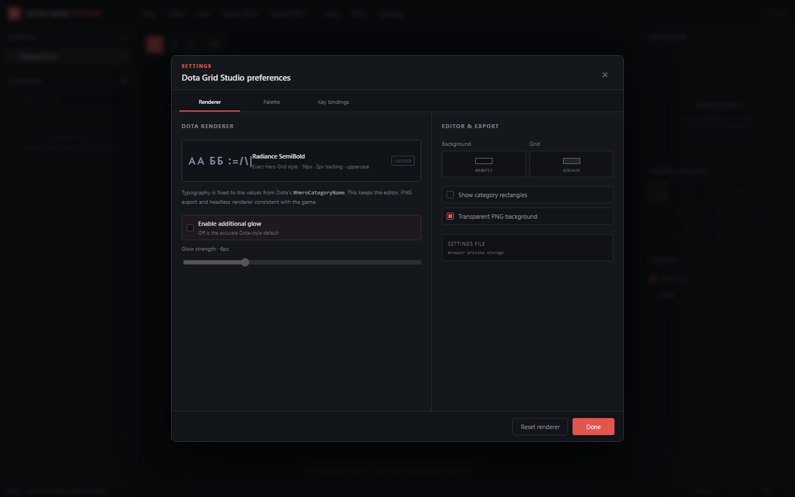
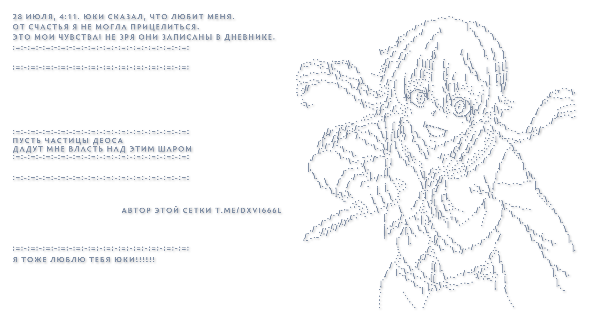

# Dota Grid Studio

Небольшой Windows-редактор кастомных Hero Grid для Dota 2. Открывает и сохраняет `hero_grid_config.json`, позволяет собирать символьные арты на canvas и рендерить их в PNG через интерфейс или CLI.



<details>
<summary>Настройки рендера</summary>



</details>

## Возможности

- Открытие, проверка и сохранение существующих Hero Grid JSON без удаления неизвестных полей.
- Несколько сеток в одном файле; брошенный в окно JSON открывается или добавляет свои сетки в текущий проект.
- Быстрый canvas для тысяч категорий, масштабирование и перемещение рабочей области.
- Одиночное, множественное и рамочное выделение; групповое перемещение и удаление без привязки координат к сетке.
- Настраиваемая палитра символов и строк, пользовательские горячие клавиши, undo/redo и copy/paste.
- Временные изображения-референсы через drag & drop или `Ctrl+V`; их можно перемещать, масштабировать и отправлять выше или ниже сетки.
- Встроенный шрифт Dota 2 Radiance SemiBold и фиксированная игровая типографика.
- PNG-экспорт с прозрачным или цветным фоном и опциональным glow.
- Headless CLI-рендер без открытия окна приложения.
- Настройки и список недавних файлов хранятся рядом с `.exe`.

### Пример PNG-рендера



## Запуск готовой версии

1. Скачайте `dota-grid-maker-windows-amd64.exe` из раздела **Releases**.
2. Поместите файл в папку, доступную для записи: рядом с ним будет создан `dota-grid-studio.settings.json`.
3. Запустите `.exe` и откройте `hero_grid_config.json` через **Open**, перетащите файл в окно или передайте путь в командной строке.

Приложение рассчитано на Windows 10/11 и использует установленный в системе WebView2 Runtime.

## Разработка и локальная сборка

Понадобятся:

- Go версии из [`go.mod`](go.mod);
- Node.js 20+ и npm;
- Wails CLI `v2.12.0`;
- Windows с WebView2 Runtime.

```powershell
go install github.com/wailsapp/wails/v2/cmd/wails@v2.12.0
cd frontend
npm ci
cd ..
wails dev
```

Production-сборка:

```powershell
go test ./...
wails build
```

Готовый файл появится в `build/bin/dota-grid-maker.exe`.

## CLI

Открыть проект в редакторе:

```powershell
dota-grid-maker.exe hero_grid_config.json
dota-grid-maker.exe --open hero_grid_config.json
```

Срендерить PNG и завершить процесс, не открывая интерфейс:

```powershell
dota-grid-maker.exe --render hero_grid_config.json --output preview.png
```

| Параметр | Назначение |
| --- | --- |
| `--open FILE` | Открыть JSON в desktop-редакторе |
| `--render FILE` | Срендерить JSON в PNG и завершить работу |
| `--output FILE` | Путь выходного PNG; без него используется имя входного JSON |
| `--config NAME\|INDEX` | Имя или индекс сетки, по умолчанию `0` |
| `--scale NUMBER` | Масштаб рендера от `0` до `16`, по умолчанию `2` |
| `--padding PIXELS` | Отступ вокруг изображения, по умолчанию `32` |
| `--background transparent\|#RRGGBB` | Прозрачный или сплошной фон |
| `--glow` | Включить дополнительное свечение символов |
| `--help`, `-h` | Показать справку |

Пример с конкретной сеткой и непрозрачным фоном:

```powershell
dota-grid-maker.exe --render hero_grid_config.json `
  --config "My Grid" `
  --output my-grid.png `
  --scale 3 `
  --padding 48 `
  --background "#0d0f13"
```

CLI использует тот же встроенный Radiance SemiBold и те же параметры типографики, что desktop-preview.

## Ручной релиз через GitHub Actions

Workflow **Manual Windows Release** запускается только вручную:

1. Откройте вкладку **Actions** → **Manual Windows Release**.
2. Нажмите **Run workflow** и выберите ветку или коммит.
3. При необходимости задайте tag; пустое значение создаст уникальный tag автоматически.
4. После тестов workflow соберёт Windows `.exe`, рассчитает SHA-256 и создаст GitHub Release.

Описание релиза автоматически формируется из полного сообщения выбранного коммита.

